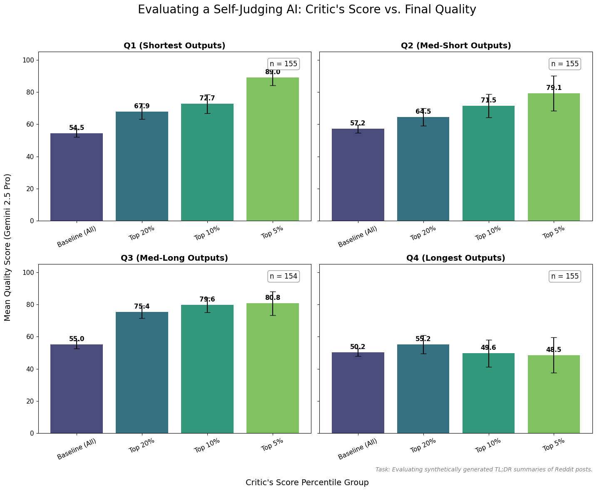

# Self-Judging AI for Post Generation

**TL;DR**

This project explores a self-improvement loop for text generation. The core hypothesis is that **judging text quality is an easier task than generating it**. We start with a pretrained language model and the [TL;DR dataset](https://huggingface.co/datasets/trl-lib/tldr).

* **Step 1: Supervised Fine-Tuning (SFT)**
    We train a model on a **reverse task**: generating a full Reddit post from a given TL;DR summary.

* **Step 2: Synthetic Data Generation**
    We use the SFT model to generate a large dataset of synthetic Reddit posts.

* **Step 3: Critic Training**
    We train a "critic" to distinguish between real, human-written posts and our synthetically generated ones.

**Result**: The critic's internal score serves as a strong proxy for text quality, correlating well with ratings from an external judge (Google's Gemini 2.5 Pro). This allows for efficient, large-scale filtering of synthetic data to select only the highest-quality examples.

* **Interactive Demo Viewer**: [https://ultra-grok.github.io/my-site-viewer](https://ultra-grok.github.io/my-site-viewer). View the generated posts and hover over tokens to see the critic's live probability trace.

---

## Key Result: Critic Score Correlates with Quality

The plot below is the central finding of this project. It shows that as our internal critic's score increases (moving from "Baseline" to "Top 5%"), the final quality score assigned by Gemini 2.5 Pro also increases significantly, especially for shorter texts (Q1-Q3).

<table align="center">
<tr>
<td align="center"><b>Evaluating a Self-Judging AI: Critic's Score vs. Final Quality</b></td>
</tr>
<tr>
<td>

</td>
</tr>
</table>

---

## 1. Installation

1.  **Clone the repository:**
    ```bash
    git clone [https://github.com/ultra-grok/posttrain-lm.git](https://github.com/ultra-grok/posttrain-lm.git)
    cd posttrain-lm
    ```

2.  **Install the required packages:**
    It is recommended to use a virtual environment.
    ```bash
    pip install -r generator/requirements.txt
    ```

---

## 2. Goal

The project's goal is to create a system that can generate high-quality, long-form text and accurately judge its own output. This is broken down into two main phases.

### 2.1. Supervised Fine-Tuning (SFT) for Post Generation

First, the model learns the "reverse-TLDR" task: generating a plausible, full-length Reddit post based only on a short summary.

**Prompt Snippet (Input):**
> New post:
> TLDR:My sister wants me to dye my hair; I refused, and she might kick me out of the wedding.
> SUBREDDIT:

**SFT Model Output (Generated Post):**
> My (30F) sister (28F) is getting married in a few months. She's become a complete bridezilla and is demanding all bridesmaids dye their hair champagne blonde for her 'aesthetic'. I have naturally dark brown hair and I don't want to damage it with bleach. I refused, and now she's threatening to kick me out of the wedding...

### 2.2. Critic Model for Quality Filtering

After generating thousands of posts, we need a way to filter out the incoherent or poorly written ones. To do this, we train a critic model to predict a token-level probability that distinguishes between authentic human-written posts and posts generated by our SFT model.

---

## 3. Methodology

### 3.1. Supervised Fine-Tuning (SFT)

We fine-tune a large language model for a single epoch on the reverse task (`TL;DR -> Post`). The training uses **LoRA** (Low-Rank Adaptation) for parameter-efficient fine-tuning, leveraging `bfloat16` for improved speed and memory usage.

### 3.2. Critic Training

1.  **Model Architecture**: We take the SFT-trained generator model and attach a single **linear layer** (`discriminator_head`) to the output of the final transformer block. During this phase, we train **both the LoRA adapters and the new linear head**.

2.  **Training Data**: The critic is trained on a mixed dataset:
    * **Positive Examples (Label = 1)**: Real posts from the original `trl-lib/tldr` dataset.
    * **Negative Examples (Label = 0)**: Synthetic posts created by our SFT generator.

3.  **Training Objective**: The model is trained with a standard **Binary Cross-Entropy (BCE)** loss. The goal is for the critic head to predict a high probability for tokens from real posts and a low probability for tokens from generated posts.

4.  **Inference and Scoring**: By examining the probability traces in the **interactive viewer**, we discovered that the **sum of the logits for the last 5 tokens** serves as a powerful heuristic for the overall quality of a generated post. The intuition is that the model's confidence and coherence as it concludes the generation is a strong proxy for the quality of the entire passage.

### 3.3. External Validation with Gemini

To validate our critic's effectiveness, we used the **Google Gemini 2.5 Pro API** to rate a subset of our generated posts on a scale of 0-100. This gave us a "gold standard" to prove our cheap, internal critic measures something meaningful about human-perceived quality.

---

## 4. Results and Analysis

The analysis reveals a strong but nuanced relationship between the critic's score and the final quality rating, which is heavily dependent on the length of the generated text.

* **Q1 (Shortest Outputs):** Shows the most dramatic effect. The mean rating jumps from a baseline of 54.5 to 89.0 for the top 5% of critic-scored posts, a ~35-point increase.
    * Baseline (n=155): Mean Rating 54.5
    * Top 20% (n=31):  Mean Rating 67.9
    * Top 10% (n=16):  Mean Rating 72.7
    * Top 5% (n=8):   Mean Rating 89.0

* **Q2 (Med-Short Outputs):** Displays a strong positive trend. The mean rating rises from a baseline of 57.2 to 79.1 for the top 5%.
    * Baseline (n=155): Mean Rating 57.2
    * Top 20% (n=31):  Mean Rating 64.5
    * Top 10% (n=16):  Mean Rating 71.5
    * Top 5% (n=8):   Mean Rating 79.1

* **Q3 (Med-Long Outputs):** Also shows a significant positive correlation. The mean rating increases from a baseline of 55.0 to 80.8 for the top 5%.
    * Baseline (n=154): Mean Rating 55.0
    * Top 20% (n=31):  Mean Rating 75.4
    * Top 10% (n=16):  Mean Rating 79.6
    * Top 5% (n=8):   Mean Rating 80.8

* **Q4 (Longest Outputs):** Reveals the breakdown in the pattern. The critic's score becomes a neutral or negligible indicator. The mean rating for the top 5% (48.5) is slightly lower than the baseline (50.2).
    * Baseline (n=155): Mean Rating 50.2
    * Top 20% (n=31):  Mean Rating 55.2
    * Top 10% (n=16):  Mean Rating 49.6
    * Top 5% (n=8):   Mean Rating 48.5

### Hypothesis for Future Work

The performance degradation observed in the longest posts (Q4) suggests a limitation of the current approach. Our hypothesis is that the critic is **undertrained**, as it was exposed to only ~15,000 examples (~9k generated, ~6k human).

We hypothesize that scaling up the critic's training data would lead to two significant improvements:
1.  **Greater Accuracy**: An even stronger and more reliable correlation between the critic's score and true quality.
2.  **Improved Generalization**: The critic would learn the nuances of longer narratives, resolving the performance drop-off currently seen in the longest quartile of posts.

---

## 5. Appendix: Minimal Commands

-   **Train SFT Generator**:
    ```bash
    python generator/sft_bfloat.py
    ```
-   **Generate Synthetic Dataset**:
    ```bash
    python generator/gen_bfloat16.py
    ```
-   **Train Critic Head**:
    ```bash
    python generator/linear_head.py
    ```
-   **Evaluate with Gemini API (Requires API Key)**:
    ```bash
    python generator/eval.py
    ```
-   **Plot Final Results**:
    ```bash
    python generator/plot_result.py
    ```
