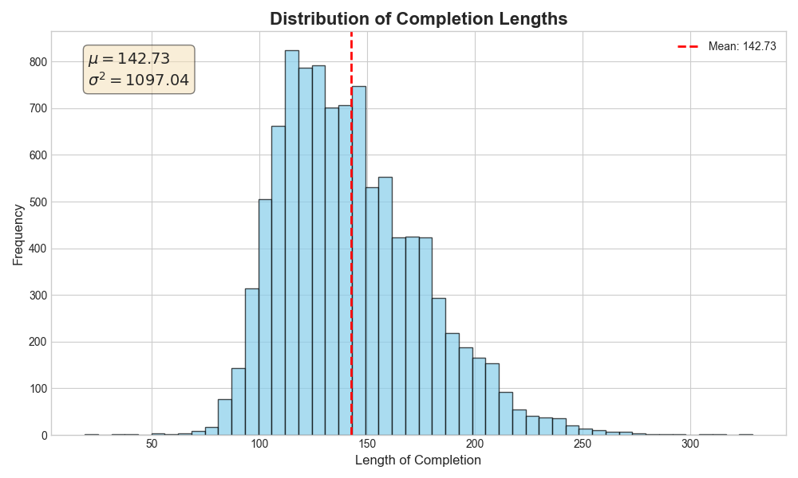
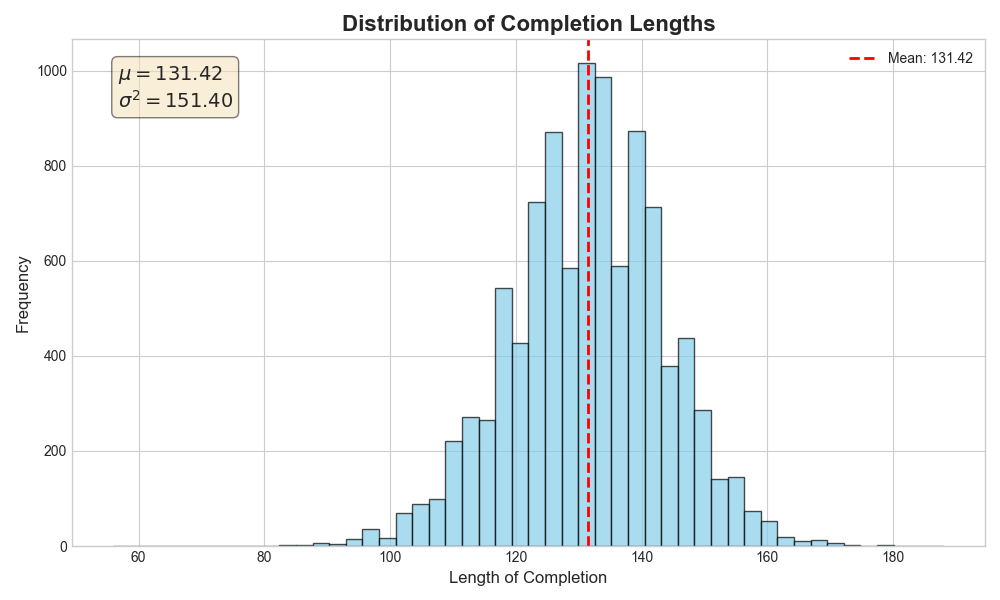

# Post-training language models (SFT → RL), with TL;DR summary length control as an example.

**TL;DR**

We start with a pretrained language model and the [TL;DR dataset](https://huggingface.co/datasets/trl-lib/tldr) containing Reddit posts and their summaries. We then apply the following two-step process:

  * **Step 1: Supervised Fine-Tuning (SFT)**
    We train a supervised policy on the `post -> summary` task.

  * **Step 2: Reinforcement Learning (RL)**
    We optimize the policy against a reward function shaped to favor summaries of a medium length, discouraging overly long or short outputs.

**Result**: This process yields high-quality summaries while achieving an **\~7× variance reduction** (from 1100 to 150) in output length, stabilizing the mean at \~140 characters with no observed degradation in summary quality.

  * **Demo Viewer (SFT vs. RL)**: [https://ultra-grok.github.io/my-site-viewer](https://ultra-grok.github.io/my-site-viewer)

-----

## 1\. Installation

1.  **Clone the repository:**

    ```bash
    git clone https://github.com/ultra-grok/posttrain-lm.git
	cd posttrain-lm
	```

2.  **Install the required packages:**
    It is recommended to use a virtual environment.

    ```bash
    pip install -r requirements.txt
    ```

-----

## 2\. Goal

We tune the model in two stages. First, we teach it to summarize. Second, we teach it to stay within a target length.

### 2.1. Supervised Fine-Tuning (SFT)

The model first learns the summarization task, but its output length is inconsistent.

**Prompt Snippet:**

> SUBREDDIT: r/relationships
>
> TITLE: My sister (28F) is demanding I (30F)...
>
> POST: ...she's become a complete bridezilla and is demanding all bridesmaids dye their hair champagne blonde for her 'aesthetic'... I refused, and now she's threatening to kick me out of the wedding...
>
> TL;DR:

**Typical SFT Output (Often too long or short):**

> "The user wants to know if they are in the wrong for refusing to dye their dark brown hair blonde for their sister's wedding aesthetic..."

### 2.2. Reinforcement Learning (RL) for Length Control

The RL stage rewards summaries that are both accurate and within a target length, teaching the model to avoid outputs that are too brief or too verbose.

| Model TLDR Output                                                                                         | Reward   | Why?                 |
| --------------------------------------------------------------------------------------------------------- | :------: | -------------------- |
| "Sister angry about hair dye."                                                                            |   Low    | too short            |
| "My sister wants me to dye my hair; I refused, and she might kick me out of the wedding."                   | **High** | concise & complete   |
| "A person is in a conflict with ... [200 characters omitted]"                                             |   Low    | too long             |

This process creates a model that reliably produces well-formed summaries of a predictable length.

-----

## 3\. Training Methodology

### 3.1. Supervised Fine-Tuning (SFT)

We start with the **`NousResearch/Llama-3.2-1B`** base model, and quantized to 4-bits for memory efficiency. Using the **`trl-lib/tldr`** dataset, we fine-tune the model for a single epoch with a supervised, next-token prediction objective.

The training is performed using **LoRA** (Low-Rank Adaptation) and the AdamW optimizer, with a cosine learning rate decay.

### 3.2. Reinforcement Learning (RL) for Length Control

To control summary length, we further refine the SFT model using a **PPO-style objective**. This stage uses the SFT model as a frozen reference to ensure the new model doesn't forget how to summarize well. The total loss is calculated as the policy loss plus a KL-divergence penalty, averaged over all summary tokens in a batch.

**Final Loss = PolicyLoss + (beta \* KLDivergence)**

Here's a breakdown of each component:

  * **PolicyLoss**: This is the core of PPO, designed to increase the probability of outputs that lead to higher rewards. It's calculated as the negative of the "clipped surrogate objective."

      * `advantage`: A score given to each summary token. It's high if the summary's length is near our target and low otherwise.
      * `ratio`: The probability ratio, calculated as `new_policy_prob(token) / frozen_sft_prob(token)`.
      * `PolicyLoss = -min(ratio * advantage, clipped_ratio * advantage)`

  * **KLDivergence**: This is a penalty term that keeps the new RL model's behavior close to the original SFT model. It prevents the model from sacrificing summary quality for the sake of getting the length right. We use a stable and non-negative estimator for the KL divergence:

      * `r = frozen_sft_prob(token) / new_policy_prob(token)`
      * `KLDivergence = r - 1 - log(r)`

  * **beta**: A small coefficient (e.g., `0.01`) that controls how heavily we penalize the model for deviating from the SFT policy.

### 3.3. Key RL Implementation Details

#### 3.3.1. Stable KL-Divergence Estimator

The specific formula for `KLDivergence` (`r - 1 - log(r)`) was chosen because it is **always non-negative**. This provides a more stable training signal compared to naive KL estimators, which can sometimes produce negative values due to sampling error. This approach is discussed by John Schulman in his blog post on [Approximating KL Divergence](http://joschu.net/blog/kl-approx.html).

#### 3.3.2. Tuning the KL-Divergence

We tune the `beta` coefficient by monitoring the KL-divergence during training. Our goal is to match a target KL derived from the "Best-of-N" sampling principle. For example, to achieve a quality level comparable to sampling 3 times and picking the best summary (Best-of-3), we would aim for a target KL of `log(3) - 2/3 ≈ 0.43`. This provides a principled way to set the divergence budget. (Reference: [Best-of-N KL Targets](https://www.jacobh.co.uk/bon_kl.pdf)).

#### 3.3.3. Per-Token Advantage Calculation

The advantage signal is calculated in several steps to create a stable reward that peaks for average-length summaries:

  * **Raw Score**: The initial score for each summary is its negative length (`-length`), which is then standardized (z-scored) across all generated examples. A z-score of `0` means the summary has an average length.
  * **Reward Shaping**: The z-score is transformed into a reward signal using the formula `Reward = 1 - abs(z_score)`. This creates a reward that peaks at `1.0` for summaries of average length and decreases for those that are shorter or longer.
  * **Token-Level Distribution**: The summary-level reward is then distributed evenly across each of its tokens:
    `Per-Token Advantage = TotalReward / NumberOfTokensInCompletion`
  * **Advantage Whitening**: Finally, within each training mini-batch, we **normalize** these per-token advantages (subtracting the batch mean and dividing by the standard deviation).

-----

## 4\. Qualitative Analysis & Limitations

As demonstrated in the [Live Demo Viewer](https://ultra-grok.github.io/my-site-viewer), the RL-tuned model successfully produces summaries of a consistent length. However, this control introduces clear trade-offs:

  * **Loss of Nuance:** On complex prompts, the strict length constraint can force the model to omit secondary details that the more verbose SFT model might have captured.
  * **Abrupt Endings:** To meet the length target, the model sometimes concludes a summary with an incomplete sentence followed by an ellipsis (`...`). While functional, this can make the output feel ambiguous or unfinished.

-----

## 5\. Results: Variance Reduction Visualized

The plots below visualize the primary achievement of this project: a significant reduction in the variance of summary lengths after RL fine-tuning. The initial SFT model produces summaries with a wide and scattered length distribution. After RL, the model's outputs are tightly clustered around the target mean, demonstrating the effectiveness of the reward-shaping approach.

<table align="center">
<tr>
<td align="center"><b>Before RL (SFT Model)</b></td>
<td align="center"><b>After RL (Variance-Controlled Model)</b></td>
</tr>
<tr>
<td>

</td>
<td>

</td>
</tr>
</table>

-----

## 6\. Links and References

  - **Base model**: [https://huggingface.co/NousResearch/Llama-3.2-1B](https://huggingface.co/NousResearch/Llama-3.2-1B)
  - **TL;DR dataset**: [https://huggingface.co/datasets/trl-lib/tldr](https://huggingface.co/datasets/trl-lib/tldr)
  - **Model adapters**: [https://huggingface.co/ultra-grok/model\_tldr](https://huggingface.co/ultra-grok/model_tldr)
  - **Generated dataset**: [https://huggingface.co/datasets/ultra-grok/tldr\_sft\_gen](https://huggingface.co/datasets/ultra-grok/tldr_sft_gen)
  - **Viewer (Pages)**: [https://ultra-grok.github.io/my-site-viewer](https://ultra-grok.github.io/my-site-viewer)
  - **Stable KL estimator**: [http://joschu.net/blog/kl-approx.html](http://joschu.net/blog/kl-approx.html)
  - **Best-of-N KL targets**: [https://www.jacobh.co.uk/bon\_kl.pdf](https://www.jacobh.co.uk/bon_kl.pdf)
  - **GRPO reference**: [https://arxiv.org/abs/2402.03300](https://arxiv.org/abs/2402.03300)

-----

## 7\. Changelog

  - **v0.1**
      - SFT → generation → RL pipeline
      - Viewer and distribution plots

-----

## 8\. Appendix: Minimal Commands

  - **Train SFT**:
    ```bash
    python sft_tldr.py
    ```
  - **Create standardized generation dataset**:
    ```bash
    python gen_push.py
    ```
  - **Train RL**:
    ```bash
    python rl_tldr.py
    ```
  - **Plot len() Distribution**:
    ```bash
    python plot_len_distribution.py
    ```
Of course, here is a more concise version.

-----

## 9. To-Do

* **Configuration**: Replace hardcoded variables with `argparse` to simplify experiments.
* **Refactor Shared Code**: Move duplicated code, such as the `LanguageModel` class, into a common `utils.py` file to improve maintainability.
